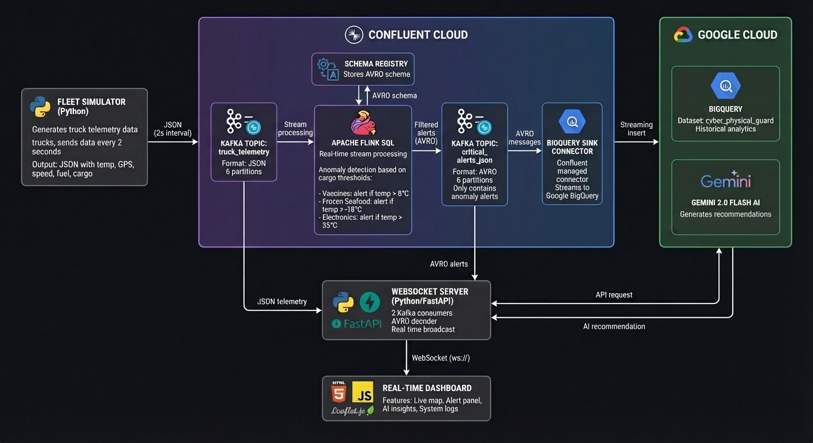

# Cyber-Physical Guard

A real-time fleet monitoring system that detects temperature anomalies in cargo trucks and generates AI-powered recommendations for fleet operators.

Built for the Confluent Challenge at Google Cloud Hackathon 2024.

## The Problem

I chose cold chain logistics because the numbers are staggering - around $35 billion is lost every year due to temperature issues in pharmaceutical shipping alone. About 30% of vaccines never make it to patients because of cold chain failures. Most monitoring systems today are reactive; by the time someone notices a problem, the cargo is already damaged.

## What I Built

This system monitors 5 trucks carrying temperature-sensitive cargo (vaccines, insulin, frozen seafood, electronics, fresh produce). When temperatures go out of range, Flink SQL catches it immediately and triggers an alert. The alert flows through to a Gemini AI model that generates specific recommendations - not just "temperature is high" but actual actionable steps like which facility to reroute to and who to notify.

The dashboard shows everything in real-time on a map. Trucks turn red when they're in trouble, and you can click on them to see the AI recommendation.

## Architecture



The data flows like this:

- Fleet simulator sends truck telemetry to Kafka every 2 seconds
- Flink SQL watches the stream and filters for temperature violations
- When something's wrong, it pushes to a separate alerts topic
- My FastAPI server picks up those alerts, hits Gemini for analysis, and broadcasts to the dashboard via WebSocket
- BigQuery stores everything for historical analysis

## Tech Stack

- Confluent Cloud (Kafka + Flink SQL + Schema Registry)
- Google Cloud (BigQuery + Gemini 2.0 Flash)
- Python with FastAPI for the backend
- Vanilla JS with Leaflet.js for the map
- Deployed on Render

## Running It Locally

Clone the repo and install dependencies:

```bash
git clone https://github.com/YOUR_USERNAME/cyber-physical-guard.git
cd cyber-physical-guard
pip install -r requirements.txt
```

Copy the env template and add your credentials:

```bash
cp .env.example .env
```

You will need:
- Confluent Cloud account (use promo code CONFLUENTDEV1 for free credits)
- Google Cloud project with Gemini API enabled

Then just run:

```bash
python app.py
```

Open http://localhost:8000 and click "Start Demo". You can run it in automatic mode where alerts trigger themselves, or manual mode where you pick which truck goes critical.

## Confluent Setup

Create two topics in Confluent Cloud:
- `truck_telemetry` (JSON, 6 partitions)
- `critical_alerts_json` (AVRO, 6 partitions)

The Flink SQL query that does the anomaly detection:

```sql
INSERT INTO critical_alerts_json
SELECT 
    truck_id,
    cargo,
    temp,
    'CRITICAL' as alert_level,
    CONCAT('Temperature anomaly: ', CAST(temp AS STRING), 'C') as alert_message,
    timestamp
FROM truck_telemetry
WHERE 
    (cargo = 'Vaccines' AND temp > 8) OR
    (cargo = 'Insulin' AND temp > 8) OR
    (cargo = 'Frozen Seafood' AND temp > -18) OR
    (cargo = 'Fresh Produce' AND temp > 6) OR
    (cargo = 'Electronics' AND temp > 35);
```

## Project Structure

```
├── app.py              # Everything runs from here - FastAPI server, Kafka consumers, simulator
├── requirements.txt
├── render.yaml         # Render deployment config
├── static/
│   ├── index.html      # Dashboard
│   └── diagram.jpeg    # Architecture diagram shown in the UI
└── docs/images/        # For GitHub readme
```

## What I Learned

Flink SQL is surprisingly powerful. I thought I'd need to write a bunch of Python code to detect anomalies, but a simple WHERE clause does the job. The tricky part was getting the AVRO serialization right between Flink and my Python consumer.

WebSocket timeouts matter in production. I added automatic session limits (4 min demo, 2 min idle disconnect) after realizing an open demo could run forever and eat up resources.

Gemini 2.0 Flash is fast enough for real-time use. The AI recommendations come back in under 2 seconds, which feels instant in the context of an alert workflow.

## Demo

The system has two modes:

**Automatic** - Sit back and watch. Different trucks will go critical every 20-30 seconds, triggering the full alert pipeline.

**Manual** - Click the truck buttons (1-5) to trigger specific scenarios. Good for showing off particular cargo types.

## License

MIT

---

Syed Asjad Sohail
asjadshah60@gmail.com
www.linkedin.com/in/syed-asjad-sohail-b388271a0
